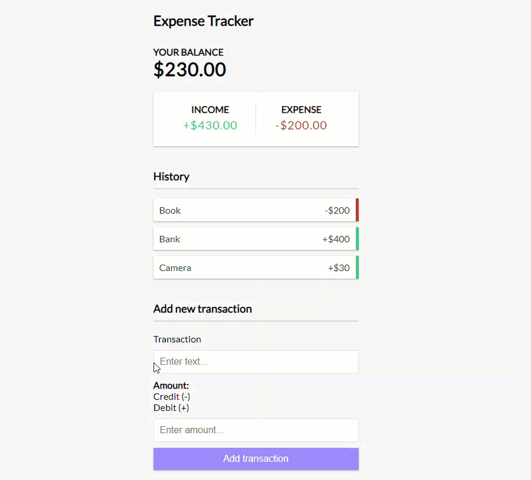

# Expense Tracker (MERN)

> Full stack expense tracker



## Usage

```
change config.env file in config folder
```

```
 npm install
 cd client npm install
 cd ..
 
 # Run front and backend
 npm run dev
 
 # Backend only
 npm run server
 
 # Frontend only
 npm run client
 
 # Build client
 cd client
 npm run build
 
 # Prod
 npm start
```